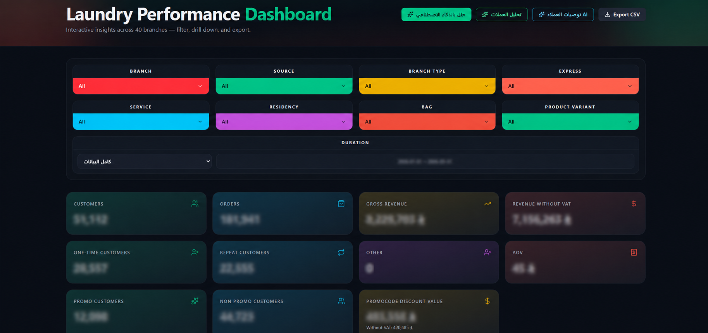
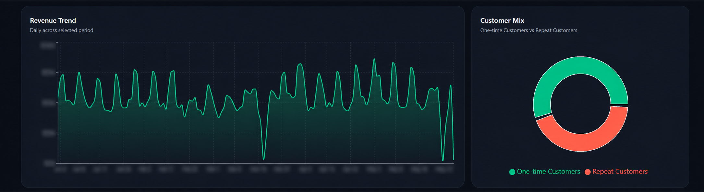
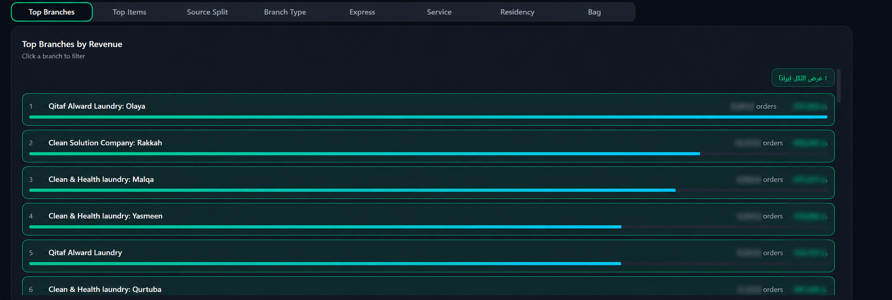
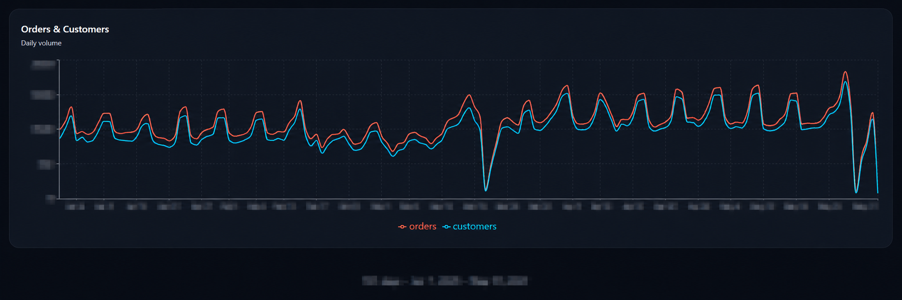
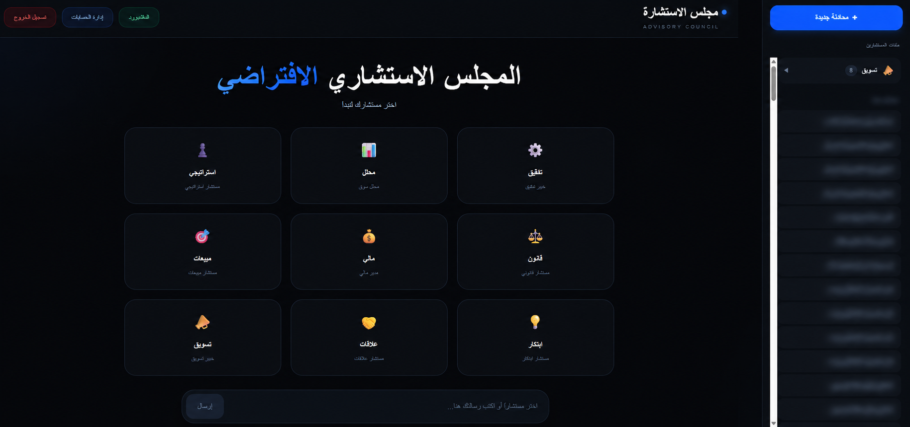
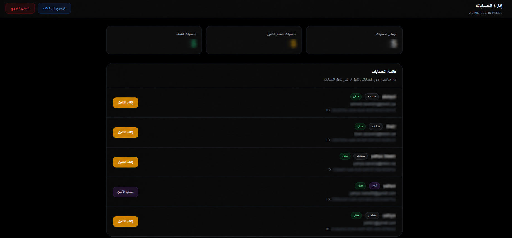
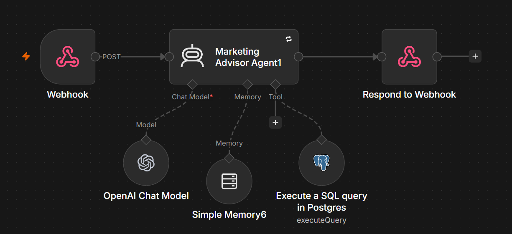

# 🧠 Enterprise AI Advisory & Analytics Platform

An enterprise AI decision-support platform combining a **business analytics dashboard**, a **multi-department AI advisory interface**, and an **n8n-powered Marketing AI Advisor** connected to business data through Supabase and PostgreSQL.

The platform was designed to help management move from raw operational data to actionable business decisions through interactive analytics and AI-assisted recommendations.

---

## 🚀 Overview

The project consists of three main components:

- **Business Analytics Dashboard** for operational, customer, revenue, branch, and service analysis.
- **AI Advisory Platform** designed to support department-specific business advisors.
- **Marketing AI Advisor Backend** powered by n8n, OpenAI, memory, and PostgreSQL analytics.

Both applications share the same logical business data layer through **Supabase**.

---

## 🏗️ Architecture

```text
                         Supabase
                  Auth + Business Data
                         /     \
                        /       \
                       v         v
          Analytics Dashboard   Advisory Platform
                   |                   |
                   |                   v
                   |                  n8n
                   |           Marketing AI Advisor
                   |              /         \
                   |          OpenAI       PostgreSQL
                   |                     Analytics Tool
                   |
                   +---- Dashboard Context ---->
```

---

## 📊 Business Analytics Dashboard

The analytics dashboard provides an interactive view of company performance using data stored in Supabase.

### Key Capabilities

- Revenue and order analytics
- Customer analysis
- Average Order Value monitoring
- Branch performance comparison
- Service and product analysis
- Customer repeat behavior
- Campaign analysis
- Multi-dimensional filtering
- AI recommendation entry points
- CSV / spreadsheet export
- Dashboard context transfer to the AI Advisory Platform

### Dashboard Overview



Interactive dashboard with business KPIs, filtering controls, and performance indicators.

### Revenue & Customer Analytics



Revenue trends and customer behavior analysis used to understand business movement over time.

### Branch Performance Analysis



Branch-level performance analysis for comparing revenue, orders, and operational performance.

### Orders & Customers Trend



Trend analysis showing the relationship between order activity and customer volume.

---

## 🤖 AI Advisory Platform

The advisory interface was designed as a **multi-department AI decision-support system**.

The platform UI supports advisor domains such as:

- Strategy
- Marketing
- Sales
- Finance
- Audit
- Legal
- Business Analysis
- Relations
- Innovation

Users can select an advisor, submit a business question, and maintain conversation history within their authenticated account.

### Advisory Council Interface



Advisor selection and business-question interface designed for department-specific AI assistance.

---

## 🔐 Authentication, Roles & Administration

The platform includes access-control functionality using Supabase authentication.

Features include:

- User authentication
- Account registration
- User approval flow
- Role-based permissions
- Admin controls
- Account activation / deactivation
- User management
- Conversation history

### Admin Access Control



Administrative interface for controlling access and managing platform users.

---

## 📣 Marketing AI Advisor

The **Marketing Advisor** is the fully integrated reference implementation included in this public portfolio repository.

It is connected to the advisory interface through an n8n backend and can analyze business and marketing data before generating management-oriented recommendations.

The workflow combines:

- Webhook API entry point
- AI Agent orchestration
- OpenAI language model
- Conversation memory
- PostgreSQL analytics tool
- Structured response handling

### n8n Marketing Advisor Workflow



```text
Webhook
   ↓
Marketing Advisor Agent
   ├── OpenAI Chat Model
   ├── Conversation Memory
   └── PostgreSQL Analytics Tool
   ↓
Respond to Webhook
```

The AI Agent can use database evidence before producing recommendations instead of relying only on general language-model knowledge.

---

## 🔄 Dashboard-to-Advisor Context

One important part of the platform is the connection between the dashboard and the AI advisory interface.

When a user moves from the dashboard to the Marketing Advisor, the current analytics context can be passed with the request.

Example context can include:

```text
Date Range
Branch
Source
Branch Type
Service
Customer Segment
Current KPI Context
```

This allows the advisor to understand the user's current analytical scope instead of starting every conversation without context.

---

## 📈 AI Marketing Analysis

The Marketing Advisor was designed to support business questions such as:

- Which branch should receive the next marketing test?
- Which campaign performed best?
- How did advertising activity affect revenue?
- Which customer or service segment has growth potential?
- Where is AOV under pressure?
- Should a promotion be repeated, adjusted, or stopped?
- How should the next campaign be structured?

The advisor uses business data as evidence and returns a concise management-oriented decision.

---

## 🧠 AI Decision Flow

```text
Business Question
       ↓
Dashboard Context
       ↓
AI Marketing Advisor
       ↓
PostgreSQL Analytics
       ↓
Business Evidence
       ↓
AI Reasoning
       ↓
Executive Recommendation
```

---

## 🛠️ Tech Stack

### AI & Automation

- OpenAI
- n8n
- AI Agents
- Conversation Memory
- Tool Calling

### Frontend

- Next.js
- React
- TanStack
- TypeScript
- Tailwind CSS

### Data & Backend

- Supabase
- PostgreSQL
- Supabase Authentication
- SQL Analytics
- REST / Webhooks

### Analytics

- Recharts
- Business KPI Analysis
- Customer Analytics
- Revenue Analytics
- Branch Performance
- Campaign Analysis

---

## 📁 Repository Structure

```text
enterprise-ai-advisory-analytics-platform/
│
├── advisory-platform/
│   └── AI advisory frontend and authentication
│
├── analytics-dashboard/
│   └── Business intelligence dashboard
│
├── n8n-workflows/
│   └── marketing-advisor-backend.json
│
├── docs/
│   └── architecture.md
│
├── screenshots/
│   ├── analytics-dashboard-overview.png
│   ├── revenue-customer-analytics.png
│   ├── branch-performance-analysis.png
│   ├── orders-customers-trend.png
│   ├── advisory-council-interface.png
│   ├── admin-access-control.png
│   └── marketing-advisor-n8n-workflow.png
│
├── .gitignore
└── README.md
```

---

## ✅ Implementation Status

The platform architecture was designed to support multiple department-specific AI advisors.

The **Marketing Advisor** is the fully integrated reference implementation included in this repository.

Other advisor domains represent the extensible architecture of the platform and were not all production-enabled before the original project was paused.

This repository therefore demonstrates both:

- a working AI advisory implementation,
- and the broader architecture designed for future department-specific expansion.

---

## 🔒 Security & Privacy

This repository is a **portfolio-safe version** of the original project.

The public version intentionally excludes or replaces:

- Production Supabase credentials
- Production n8n URLs
- API credentials
- Database credentials
- Employee information
- Customer information
- Production datasets
- Internal user IDs
- Private company identifiers
- Proprietary production prompts
- Detailed internal business rules

Environment configuration is provided through `.env.example` files.

---

## ⚙️ Local Setup

### Advisory Platform

```bash
cd advisory-platform
npm install
npm run dev
```

Copy:

```text
.env.example
```

to:

```text
.env.local
```

and configure your own development credentials.

### Analytics Dashboard

```bash
cd analytics-dashboard
npm install
npm run dev
```

Copy the included `.env.example` and configure your own Supabase and integration values.

---

## 🎯 Project Goal

The goal of this project is to demonstrate how **AI agents, business intelligence, automation, and company data** can be combined into a single decision-support platform.

```text
Collect Data
     ↓
Analyze Performance
     ↓
Identify Opportunities
     ↓
Ask AI Advisor
     ↓
Query Business Data
     ↓
Generate Recommendation
     ↓
Support Management Decision
```

---

## 📌 Portfolio Note

This repository contains a sanitized public implementation created for demonstration and portfolio purposes.

Production credentials, confidential datasets, private company information, and proprietary business logic are intentionally excluded.
